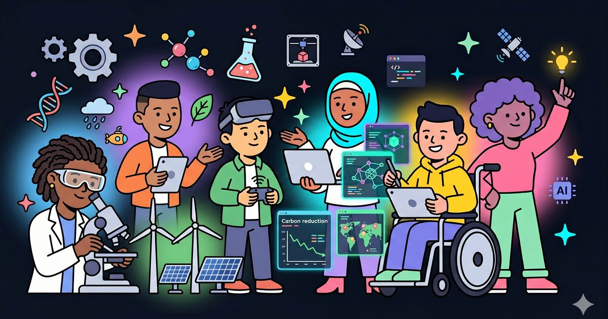

<div align="center">

# WinSci

**Future skills for every mind.**

A free, accessible, trilingual learning platform for women and students with disabilities.
Take courses in AI, programming, design, and communication, or become a creator and teach what you know.

[](https://nextjs.org)
[](https://react.dev)
[](https://www.typescriptlang.org)
[](https://tailwindcss.com)
[](#accessibility)



</div>

---

## Table of contents

- [Overview](#overview)
- [Features](#features)
- [Tech stack](#tech-stack)
- [Getting started](#getting-started)
- [Available scripts](#available-scripts)
- [Environment variables](#environment-variables)
- [Data and API](#data-and-api)
- [Project structure](#project-structure)
- [Accessibility](#accessibility)
- [Internationalization](#internationalization)
- [Customizing content](#customizing-content)
- [Deployment](#deployment)
- [License](#license)

## Overview

WinSci is a nonprofit learning platform built for the people most digital products overlook:
women and students with disabilities, based in Abbottabad and Lahore, with a Houston campus planned.
Anyone can take a course for free, and any creator anywhere can submit a course to teach, which the
team reviews before it is published.

Accessibility is a first-class requirement, not an add-on. Every page can be read aloud, switched
between English, Urdu (right-to-left), and Spanish, and adapted with high-contrast, larger-text, and
reduced-motion modes that persist between visits.

## Features

**Learning platform**

- Course catalog for Communication, AI and Machine Learning, Programming, and Design.
- Free enrollment through an accessible modal form that captures access needs.
- Creator course submissions, each reviewed before publishing.
- Community reviews with star ratings and moderation.
- Donations with preset tiers, a fundraising progress bar, and one-time or monthly giving.
- Results showcase: impact statistics, a student-project gallery, and success stories.

**Accessibility**

- Audio narration on every section, with a "Listen" control and a friendly mascot.
- Accessibility toolbar: high-contrast mode, three text sizes, and a reduced-motion toggle, all persisted.
- Trilingual content (English, Urdu, Spanish) with full right-to-left support and the Noto Nastaliq Urdu typeface.
- Semantic HTML, skip links, visible focus states, focus-trapped dialogs, ARIA labelling, and large touch targets.

**Craft**

- A restrained navy-and-cyan visual system with a distinct illustrated identity.
- A cinematic scroll-reveal hero on desktop and a dedicated, text-forward hero on mobile.
- Hand-tuned micro-interactions and staggered scroll reveals that respect reduced-motion preferences.
- Mobile-first navigation with a full-screen menu and a sticky action bar for one-thumb access.
- Optimized imagery (WebP), complete Open Graph and Twitter metadata, and a custom favicon set.

## Tech stack

| Area | Choice |
| --- | --- |
| Framework | Next.js 16 (App Router) |
| Language | TypeScript 5, React 19 |
| Styling | Tailwind CSS v4, shadcn-style primitives |
| Animation | Framer Motion |
| Database | SQLite via Node's built-in `node:sqlite` (no external service) |
| Text-to-speech | ElevenLabs (cloud) with a Web Speech API fallback |
| Image pipeline | sharp (build-time WebP and Open Graph generation) |
| Fonts | Space Grotesk (display), Noto Sans (body), Noto Nastaliq Urdu |

## Getting started

### Prerequisites

- Node.js 24 or newer. The API routes use the built-in `node:sqlite`, which is stable from Node 24. The project was developed on Node 26.
- npm.

### Installation

```bash
git clone <your-repo-url> winsci
cd winsci
npm install
cp .env.example .env.local   # optional; see Environment variables
npm run dev
```

Open http://localhost:3000 in your browser.

## Available scripts

| Command | Description |
| --- | --- |
| `npm run dev` | Start the development server |
| `npm run build` | Create a production build |
| `npm run start` | Run the production build |
| `npm run lint` | Run ESLint |

## Environment variables

All variables are optional. The application runs without them and degrades gracefully.

| Variable | Purpose | Default |
| --- | --- | --- |
| `ELEVENLABS_API_KEY` | Enables cloud text-to-speech with one consistent human voice across languages. Without it, narration falls back to the visitor's best device voice. | unset |
| `ELEVENLABS_VOICE_ID` | Overrides the narration voice. | `EXAVITQu4vr4xnSDxMaL` |
| `ELEVENLABS_MODEL` | Overrides the text-to-speech model. | `eleven_multilingual_v2` |
| `NEXT_PUBLIC_SITE_URL` | Canonical URL used for Open Graph, Twitter, and canonical links. | `https://winsci.org` |
| `WINSCI_DATA_DIR` | Location of the SQLite database in production. | `./data` in production, OS temp directory in development |

## Data and API

Form submissions persist to a local SQLite database (`src/lib/db.ts`, no external dependency). Four
route handlers back the application:

| Endpoint | Method | Stores |
| --- | --- | --- |
| `/api/enroll` | POST | Course enrollments (name, contact, city, course, access needs) |
| `/api/submit-course` | POST | Creator course submissions, saved as pending for review |
| `/api/reviews` | GET, POST | GET returns approved reviews; POST saves a review as pending |
| `/api/tts` | POST | Returns narration audio, cached on disk by content hash |

Moderation: course submissions and reviews are stored with a status of `pending`. Approving a review
(setting its status to `approved` via an admin script or SQL update) causes it to appear automatically
in the Reviews section.

## Project structure

```
src/
  app/
    layout.tsx          Root layout: fonts, metadata, providers
    page.tsx            Homepage composition
    globals.css         Design tokens, theme, accessibility modes, motion
    api/                Route handlers (enroll, submit-course, reviews, tts)
  i18n/                 LanguageProvider and English, Urdu, Spanish dictionaries
  a11y/                 AccessibilityProvider (contrast, text size, motion)
  audio/                Speech engine (cloud TTS with device fallback)
  lib/                  SQLite helpers and utilities
  components/
    ui/                 Reusable primitives (Button, scroll hero, background paths)
    sections/           Hero, Modules, Approach, Impact, Gallery, Stories,
                        Locations, Teach, Donate, FAQ, Contact, Footer
    illustrations/      SVG artwork
public/                 Optimized images, icons, and the Open Graph image
```

## Accessibility

Accessibility is a core requirement of the product:

- Audio first: any content can be heard aloud, which matters for non-reading users.
- Adaptable interface: high-contrast mode, larger text, and reduced motion, remembered across sessions.
- Multilingual and right-to-left: complete English, Urdu, and Spanish translations with correct directionality.
- Keyboard and screen reader support: semantic landmarks, a skip link, focus management, ARIA, and large touch targets.
- Motion aware: every animation honors the `prefers-reduced-motion` setting and the in-app toggle.

## Internationalization

All copy lives in `src/i18n/translations.ts`, keyed by section across English (`en`), Urdu (`ur`), and
Spanish (`es`). The active language is stored locally and applied to the `lang` and `dir` attributes on
the document, switching the layout to right-to-left and the Urdu typeface automatically. Adding a
language means adding one dictionary entry.

## Customizing content

- Copy, courses, projects, reviews, donation tiers, and locations: `src/i18n/translations.ts`
- Colors, typography, spacing, and motion: `src/app/globals.css` (the `:root` tokens)
- Hero image: replace `public/hero-learners.webp` (used by every hero variant)
- Payments: the donation form is UI-complete; connect it to a provider such as Stripe in `src/components/sections/Donate.tsx`

## Deployment

The application builds to a standard Next.js output and runs anywhere Node 24 or newer is available.
When deploying:

1. Set `NEXT_PUBLIC_SITE_URL` to your production domain.
2. Set `ELEVENLABS_API_KEY` to enable the cloud voice (optional).
3. Point `WINSCI_DATA_DIR` at a persistent, writable volume so the SQLite database survives restarts.

## License

Copyright WinSci. All rights reserved. This project is currently private.
